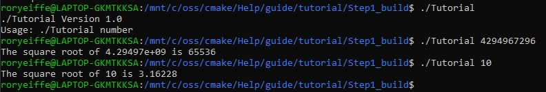
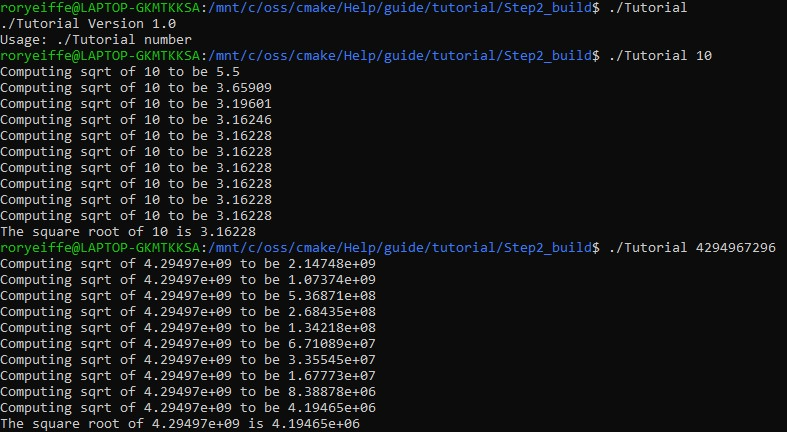

# Cmake tutorial

### Step 1:

#### Modified Code:

##### tutorial.cxx

```c
// A simple program that computes the square root of a number
#include <cmath>
#include <iostream>
#include <string>
#include <TutorialConfig.h>

int main(int argc, char* argv[])
{
  if (argc < 2) {
    // report version
    std::cout << argv[0] << " Version " << Tutorial_VERSION_MAJOR << "."
              << Tutorial_VERSION_MINOR << std::endl;
    std::cout << "Usage: " << argv[0] << " number" << std::endl;
    return 1;
  }

  // convert input to double
  const double inputValue = std::stod(argv[1]);

  // calculate square root
  const double outputValue = sqrt(inputValue);
  std::cout << "The square root of " << inputValue << " is " << outputValue
            << std::endl;
  return 0;
}

```

##### CMakeLists.txt

```
cmake_minimum_required(VERSION 3.10)

# set the project name
project(Tutorial VERSION 1.0)

# specify the C++ standard
set(CMAKE_CXX_STANDARD 11)
set(CMAKE_CXX_STANDARD_REQUIRED True)

# add the executable
add_executable(Tutorial tutorial.cxx)

configure_file(TutorialConfig.h.in TutorialConfig.h)

target_include_directories(Tutorial PUBLIC
                           "${PROJECT_BINARY_DIR}"
                           )
```

##### Output:



### Step 2

##### tutorial.cxx

```c
// A simple program that computes the square root of a number
#include <cmath>
#include <iostream>
#include <string>

#include "TutorialConfig.h"

#ifdef USE_MYMATH
#  include "MathFunctions.h"
#endif

int main(int argc, char* argv[])
{
  if (argc < 2) {
    // report version
    std::cout << argv[0] << " Version " << Tutorial_VERSION_MAJOR << "."
              << Tutorial_VERSION_MINOR << std::endl;
    std::cout << "Usage: " << argv[0] << " number" << std::endl;
    return 1;
  }

  // convert input to double
  const double inputValue = std::stod(argv[1]);

  // calculate square root
  #ifdef USE_MYMATH
    const double outputValue = mysqrt(inputValue);
  #else
    const double outputValue = sqrt(inputValue);
  #endif
  std::cout << "The square root of " << inputValue << " is " << outputValue
            << std::endl;
  return 0;
}

```

##### CMakeLists.txt

```
cmake_minimum_required(VERSION 3.10)

# set the project name and version
project(Tutorial VERSION 1.0)

# specify the C++ standard
set(CMAKE_CXX_STANDARD 11)
set(CMAKE_CXX_STANDARD_REQUIRED True)
option(USE_MYMATH "Use tutorial provided math implementation" ON)

# configure a header file to pass some of the CMake settings
# to the source code
configure_file(TutorialConfig.h.in TutorialConfig.h)

# add the MathFunctions library
if(USE_MYMATH)
  add_subdirectory(MathFunctions)
  list(APPEND EXTRA_LIBS MathFunctions)
  list(APPEND EXTRA_INCLUDES "${PROJECT_SOURCE_DIR}/MathFunctions")
endif()

# add the executable
add_executable(Tutorial tutorial.cxx)

target_link_libraries(Tutorial PUBLIC ${EXTRA_LIBS})

# add the binary tree to the search path for include files
# so that we will find TutorialConfig.h
target_include_directories(Tutorial PUBLIC
                           "${PROJECT_BINARY_DIR}"
                           ${EXTRA_INCLUDES}
                           )

```

##### CMakeLists.txt (Math Functions)

```c
add_library(MathFunctions mysqrt.cxx)
```

##### Output:

